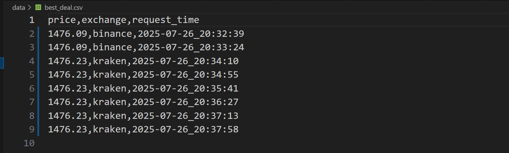
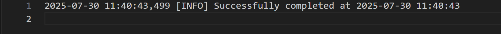

# BTC Best Price Tracker – Find the Cheapest BTC Price Across Exchanges

## 🔰 Overview

A simple CLI tool that finds the **best available price** for purchasing a given amount of BTC by querying multiple cryptocurrency exchanges. It implements a **Dollar Cost Averaging** approach, splitting the total purchase into smaller transactions spaced out over time.

## 🔧 Tech Stack

**Language**:  
- Python 3.12

**Core Libraries**:  
- `requests` – REST API integration  
- `pandas` – data handling and transformations  
- `json` – snapshot serialization  
- `logging` – event and error tracking  
- `os`, `time`, `datetime` – OS interaction and scheduling

**Design & Architecture**:  
- Object-Oriented Design with polymorphic exchange methods  
- Snapshot validation and structured error logging  
- Modular file structure with separation of concerns


## 📊 How It Works

- Pulls **order book data** from 3 major exchanges: **Binance**, **Coinbase**, and **Kraken**
- Determines the **cheapest exchange** for each transaction
- Saves each order book snapshot and best deal data locally
- Calculates the **total cost** for the entire order after execution

> 🧠 I'm currently working on a follow-up project using **WebSocket streaming** to maintain a live local order book for real-time pricing.You can check it out [here](https://github.com/DDataAly/local_order_book).

## ▶️ Usage Instructions

Run from the command line:

```bash
python main.py
```

You'll be prompted to input:\
💠 Total BTC amount to purchase\
💠 Duration of the purchase window (in seconds)\
💠 Number of transactions (optional, default is one every 10 seconds)\

## ◀️ Output
In CLI:\
💠 Best price per transaction\
💠 Final total cost after all transactions

Saved Locally:\
💠 data/best_deal.csv – records best price and exchange per transaction\
💠 exchange-specific folders (e.g., data/binance/) store raw JSON snapshots

## 🖥️ Demo Output






## 📁 File Structure
```
BTC best price tracker
├── main.py                      # Main execution script
├── data/                        # Saved snapshots, CSV output and log
│   ├── best_deal.csv
│   └── log.txt
├── src/
│   ├── exchanges/               # Exchange-specific API wrappers
│   │   ├── base.py
│   │   ├── binance.py
│   │   ├── coinbase.py
│   │   └── kraken.py
│   └── utils/                   # Utility functions
│       ├── get_best_price.py
│       ├── logger.py
│       └── helpers.py
├── .gitignore
├── requirements.txt
└── README.md
```

## 📌 Future Improvements
- Switch to WebSocket streaming for real-time updates
- Add unit tests for core pricing logic


